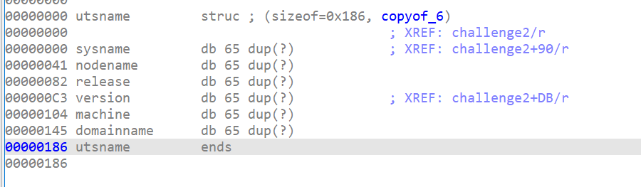

# QiLingLab Solutions

# 介绍

固件fuzz中，模拟固件不可或缺，由于qemu有点臃肿，而qiling貌似比较灵活，所以想用qiling试试固件的模拟，首先熟悉qiling的api和代码，做一下qilinglab，主要有11个challenge。

> 分为aarch64和x86主要的区别是寄存器和指令长度，除了最后一个challenge其他挑战仅分析x86
>

## challenge 1

第一个challenge是访问0x1337处的值和1337比较

```python
_BYTE *__fastcall challenge1(_BYTE *a1)
{
  _BYTE *result; // rax

  result = (_BYTE *)*(unsigned int *)((char *)&loc_1335 + 2);
  if ( *(_DWORD *)((char *)&loc_1335 + 2) == 1337 )
  {
    result = a1;
    *a1 = 1;
  }
  return result;
}
```

由于0x1337所在的内存地址是不能访问的(地址太小)，所以需要通过map映射，赋予访问权限，然后改写其值

```python
ql.mem.map(0x1000,0x1000)
ql.mem.write(0x1337,int(1337).to_bytes(2,byteorder="little"))
```

## challenge 2

第二个challenge需要了解uname系统调用相关的内容，主要逻辑是通过uname向name中写入系统相关的信息，然后比较sysname和version信息。

```python
if ( uname(&name) )
  {
    perror("uname");
  }
  else
  {
    strcpy(s, "QilingOS");
    strcpy(v8, "ChallengeStart");
    v2 = 0;
    v3 = 0;
    while ( v4 < strlen(s) )
    {
      if ( name.sysname[v4] == s[v4] )
        ++v2;
      ++v4;
    }
    while ( v5 < strlen(v8) )
    {
      if ( name.version[v5] == v8[v5] )
        ++v3;
      ++v5;
    }
    if ( v2 == strlen(s) && v3 == strlen(v8) && v2 > 5 )
      *a1 = 1;
  }
```

其中函数定义及其相关结构体的信息如下

```c
int uname(struct utsname *buf);
//uname() returns system information in the structure pointed to by buf.  The utsname struct is defined in <sys/utsname.h>:
struct utsname {
               char sysname[];    /* Operating system name (e.g., "Linux") */
               char nodename[];   /* Name within "some implementation-defined
                                     network" */
               char release[];    /* Operating system release
                                     (e.g., "2.6.28") */
               char version[];    /* Operating system version */
               char machine[];    /* Hardware identifier */
           #ifdef _GNU_SOURCE
               char domainname[]; /* NIS or YP domain name */
           #endif
           };
```

其中char数组的大小和操作系统相关，这里是65



hook代码如下

```python
def my_uname(ql, buf, *args, **kwargs):
        ql.mem.write(buf, b"QilingOS".ljust(65, b"\x00"))
        buf += 65
        ql.mem.write(buf, b"QilingOS".ljust(65, b"\x00"))
        buf += 65
        ql.mem.write(buf, b"4.19.128".ljust(65, b"\x00"))
        buf += 65
        ql.mem.write(buf, b'ChallengeStart'.ljust(65, b'\x00'))

        return 0
    ql.set_syscall("uname",my_uname)
```

## challenge 3

伪造/dev/urandom同时需要hook系统调用getrandom

通过继承QlFsMappedObject对象并实现设备的read，close，fstat方法，伪造/dev/urandom

getrandom的系统调用定义如下

```c
ssize_t getrandom(void *buf, size_t buflen, unsigned int flags);
/*
The getrandom() system call fills the buffer pointed to by buf
with up to buflen random bytes.  These bytes can be used to seed
user-space random number generators or for cryptographic purposes.
*/
```

伪造文件和hook代码如下

```python
class Fake_urandom(QlFsMappedObject):
    def read(self,size):
        if size>1:
            return b"a"*size
        else:
            return b"?"

    def fstat(self):
        return -1
    def close(self):
        return 0

def my_getrandom(ql,buf,buflen,flags,*args,**kwargs):
    ql.mem.write(buf,b"a"*buflen)
    return buflen
ql.add_fs_mapper("/dev/urandom",Fake_urandom())
ql.set_syscall("getrandom",my_getrandom)
```

## challenge 4

通过hook寄存器或者栈的值，更改程序流进入循环中


改写eax或者[rbp-8]处的值为1，进入loc_e35

```python
def hook_eax(ql):
    ql.reg.eax = 1
# get_lib_base need the real filename which is qilinglab-x86_64
base = ql.mem.get_lib_base(os.path.split(ql.path)[-1])
# base = 0x555555554000
ql.hook_address(hook_eax,base+0xE43)
```

## challenge 5

需要hook rand，其为libc库函数，hook其返回值为0

```c
for ( i = 0; i <= 4; ++i )
  {
    v5[i] = 0;
    v5[i + 8] = rand();
  }
  for ( j = 0; j <= 4; ++j )
  {
    if ( v5[j] != v5[j + 8] )
    {
      *a1 = 0;
      return __readfsqword(0x28u) ^ v6;
    }
  }
  *a1 = 1;
```

不过hook之后不会显示solved，只有challenge 6解决后才能显示(有点奇怪)

```python
def my_rand(ql):
    ql.reg.rax=0
ql.set_api("rand",my_rand)
```

## challenge 6

需要跳出死循环

```
.text:0000000000000EF6 ; __unwind {
.text:0000000000000EF6                 push    rbp
.text:0000000000000EF7                 mov     rbp, rsp
.text:0000000000000EFA                 mov     [rbp+var_18], rdi
.text:0000000000000EFE                 mov     [rbp+var_4], 0
.text:0000000000000F05                 mov     [rbp+var_5], 1
.text:0000000000000F09                 jmp     short loc_F12
.text:0000000000000F0B ; ---------------------------------------------------------------------------
.text:0000000000000F0B
.text:0000000000000F0B loc_F0B:                                ; CODE XREF: challenge6+22↓j
.text:0000000000000F0B                 mov     [rbp+var_4], 1
.text:0000000000000F12
.text:0000000000000F12 loc_F12:                                ; CODE XREF: challenge6+13↑j
.text:0000000000000F12                 movzx   eax, [rbp+var_5]
.text:0000000000000F16                 test    al, al
.text:0000000000000F18                 jnz     short loc_F0B
.text:0000000000000F1A                 mov     rax, [rbp+var_18]
.text:0000000000000F1E                 mov     byte ptr [rax], 1
.text:0000000000000F21                 nop
.text:0000000000000F22                 pop     rbp
.text:0000000000000F23                 retn
.text:0000000000000F23 ; } // starts at EF6
```

更改栈中的值，或者ax的值，test后跳出循环

```python
def hook_eax(ql):
        ql.reg.eax = 0
    base = ql.mem.get_lib_base(os.path.split(ql.path)[-1])
    ql.hook_address(hook_eax,base+0xf16)
```

## challenge 7

sleep的时间太长了，直接修改edi的值为1，睡眠一秒即可

```
.text:0000000000000F34                 mov     byte ptr [rax], 1
.text:0000000000000F37                 mov     edi, 0FFFFFFFFh ; seconds
.text:0000000000000F3C                 call    _sleep
```

```python
def hook_edi(ql):
        ql.reg.edi = 1
    base = ql.mem.get_lib_base(os.path.split(ql.path)[-1])
    ql.hook_address(hook_edi,base+0xF3C)
```

## challenge 8

这个challenge看起来比较奇怪，但实际上作者的目的是想让参与者练习使用在内存中利用特殊的字符串或者结构，定位到想要的指令地址。

参考[joansivion](https://joansivion.github.io/qilinglabs/),直接根据magic number搜索然后根据结构体的构造判断字符串是否是Random data

```python
addrs = ql.mem.search(ql.pack(0x3DFCD6EA00000539))
for addr in addrs:
    head_addr = addr-8
    my_struct = ql.mem.read(head_addr,24)
    string_addr, _, check_addr = struct.unpack('QQQ', my_struct)
    if ql.mem.string(string_addr) == "Random data":
        ql.mem.write(check_addr,b"\x01")
```

结构体定义

```c
struct random_struct {
  char *some_string;
  __int64 magic;
  char *check_addr;
};
```

## challenge 9

同样的hook库函数tolower,奇怪的是tolower是有参数的，但是带参数的hook不行

```c
strcpy(src, "aBcdeFghiJKlMnopqRstuVWxYz");
  strcpy(dest, src);
  for ( i = dest; *i; ++i )
    *i = tolower(*i);
  *a1 = strcmp(src, dest) == 0;
```

hook代码

```python
def my_tolower(ql,*args,**kwargs):
    return
ql.set_api("tolower",my_tolower)
```

## challenge 10

伪造文件，类似于/dev/uradom

```c
fd = open("/proc/self/cmdline", 0);
  if ( fd != -1 )
  {
    v4 = read(fd, buf, 0x3FuLL);
    if ( v4 > 0 )
    {
      close(fd);
      for ( i = 0; v4 > i; ++i )
      {
        if ( !buf[i] )
          buf[i] = 32;
      }
      buf[v4] = 0;
      if ( !strcmp(buf, "qilinglab") )
        *a1 = 1;
    }
  }
```

也可以直接echo qilinglab 到对应的文件中

```python
class Cmdline(QlFsMappedObject):
    def read(self, expected_len):
        return b"qilinglab"
    def fstat(self):
        return -1
    def close(self):
        return 0
ql.add_fs_mapper("/proc/self/cmdline",Cmdline())
```

## challenge 11

aarch64 和x86有所不同，不过都是cpuid指令，cpuid指令是将cpu的相关信息读取到通用寄存器的操作

```c
_RAX = 0x40000000LL;
  __asm { cpuid }
  v7 = _RCX;
  v8 = _RDX;
  if ( __PAIR64__(_RBX, _RCX) == 0x696C6951614C676ELL && (_DWORD)_RDX == 538976354 )
    *a1 = 1;
```

汇编指令

```c
.text:000000000000118F                 cpuid
.text:0000000000001191                 mov     eax, edx
.text:0000000000001193                 mov     esi, ebx
.text:0000000000001195                 mov     [rbp+var_30], esi
.text:0000000000001198                 mov     [rbp+var_34], ecx
.text:000000000000119B                 mov     [rbp+var_2C], eax
.text:000000000000119E                 cmp     [rbp+var_30], 696C6951h
.text:00000000000011A5                 jnz     short loc_11C0
.text:00000000000011A7                 cmp     [rbp+var_34], 614C676Eh
.text:00000000000011AE                 jnz     short loc_11C0
.text:00000000000011B0                 cmp     [rbp+var_2C], 20202062h
```

大致看一下，cpuid会将信息保存到ebx,ecx,edx中，然后进行一段比较

aarch64伪代码

```c
if ( _ReadStatusReg(ARM64_SYSREG(3, 0, 0, 0, 0)) >> 16 == 4919 )
  {
    result = (__int64)a1;
    *a1 = 1;
  }
```

aarch64汇编指令

```c
.text:00000000000013EC                 MRS             X0, #0, c0, c0, #0
.text:00000000000013F0                 STR             X0, [SP,#0x20+var_8]
.text:00000000000013F4                 LDR             X0, [SP,#0x20+var_8]
.text:00000000000013F8                 LSR             X1, X0, #0x10
.text:00000000000013FC                 MOV             X0, #0x1337
.text:0000000000001400                 CMP             X1, X0
.text:0000000000001404                 B.NE            loc_1414
```

将cpu信息保存到x0中，然后进行一些运算最后比较判断

不同于hook库函数和系统调用，这里使用hook_code对单条指令进行hook，hook指令的时候可以限制hook的范围，加速hook的效率，具体的方法是通过map的读写权限和map的文件名限制hook的范围

x86

```python
def hook_cpuid(ql,address,size):
    opcode = ql.mem.read(address,size)
    if opcode == b"\x0F\xA2":
        # bypass check and jump to next instruction
        ql.reg.ebx = 0x696C6951
        ql.reg.ecx = 0x614C676E
        ql.reg.edx = 0x20202062
        ql.reg.rip += 2
# search code segment hook every cpuid
begin, end = 0, 0
for info in ql.mem.map_info:
    if ql.path in info[3] and info[2] == 5:
        begin,end = info[:2]
ql.hook_code(hook_cpuid,begin=begin,end=end)
```

aarch64

```python
def hook_midr_el1(ql,address,size):
    opcode = ql.mem.read(address,size)
    if opcode == b"\x00\x00\x38\xD5":
        # bypass check and jump to next instruction
        ql.reg.x0 = 0x1337<<0x10
        ql.reg.arch_pc += 4
        # opcode take 4 bytes so next instruction will be pc + 4
        # 指令长度为4字节 下一条指令为 pc + 4
# search code segment hook every cpuid
begin, end = 0, 0
for info in ql.mem.map_info:
    if ql.path in info[3] and info[2] == 5:
        begin,end = info[:2]
ql.hook_code(hook_midr_el1,begin=begin,end=end)
```
